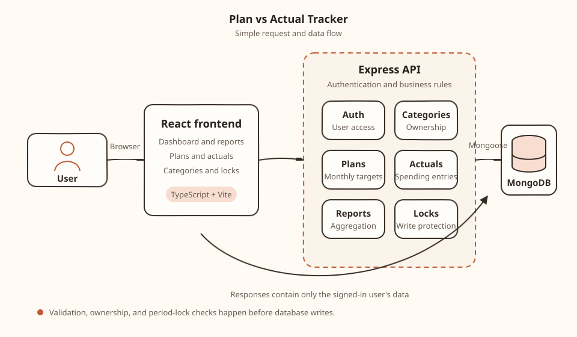

# Plan vs Actual Tracker

Set monthly spending plans by category, record actual spend, and compare the two with clear variance — including month locking so closed periods stay read-only.

**Live app:** [https://plan-vs-tracker-frontend.vercel.app](https://plan-vs-tracker-frontend.vercel.app)  


---

## Overview

This is a full-stack Plan vs Actual tracker. Each user has their own categories, plans, and actuals. The report view shows plan, actual, variance, and variance % across a month range, with charts and CSV export.

The product is built around a simple monthly workflow:

1. Create categories (Marketing, Payroll, and Tools are seeded on signup)
2. Set a plan amount for each category and month
3. Log actual spending as it happens
4. Review the report
5. Lock the month when it is closed

---

## Features

**Core**
- Auth with email and password; all data is private to the signed-in user
- Category management
- Monthly plans (one target per category per month)
- Actual entries with optional notes, plus CSV import
- Plan vs actual report with variance, charts, and CSV export
- Period locks — locked months cannot be edited in the UI or API

**Extras**
- Multi-currency preference
- AI assistant (“Ask your data”) — reads your data via tools; writes need your confirmation
- Budget email alerts when spend nears or exceeds plan

---

## Architecture



The React frontend talks to an Express API. The API owns authentication, validation, ownership checks, and period locks before reading or writing MongoDB.

| Piece | Role |
| --- | --- |
| Frontend | Dashboard, plans, actuals, report, locks |
| API | Auth, business rules, aggregation |
| MongoDB | Users, categories, plans, actuals, locks |

---

## Product rules

These are the rules the report and API follow:

- **Variance** = Actual − Plan  
- **Variance %** = (Actual − Plan) ÷ Plan × 100  
- **Missing actual** → treated as **0** (so a planned month with no spend shows full under-plan variance)  
- **Plan = 0** → variance % is shown as **—** (not `NaN` or infinity)  
- **Locks** are per calendar month (`YYYY-MM`). Once locked, create/update/delete for plans and actuals is blocked (`423`)  
- Amounts are stored as **integer minor units** (cents) to avoid floating-point issues  

---

## Tech stack

| Layer | Stack |
| --- | --- |
| Frontend | React, TypeScript, Vite, styled-components, Recharts |
| Backend | Node.js, Express, TypeScript |
| Database | MongoDB |
| Deploy | Vercel (frontend) · Render (API) |

---

## API surface

```text
/api/auth            signup, login, session
/api/categories      category CRUD
/api/plans           monthly plans
/api/actuals         spending entries + CSV
/api/reports         plan vs actual
/api/period-locks    lock a month
/api/assistant       AI chat (optional)
```

---

## CSV import

```csv
category,month,amount,note
Marketing,2026-08,1250.50,August campaign
Tools,2026-08,89.99,Design subscription
```

Category must exist, month must be `YYYY-MM`, amount must be greater than zero, and locked months are rejected.

---

## Assumptions

- Locking is month-level only, and locks are permanent in this version (no unlock).
- Zero-filling missing actuals keeps reports and charts numeric and easy to compare.
- The AI never writes to the database until the user confirms the proposed change.
